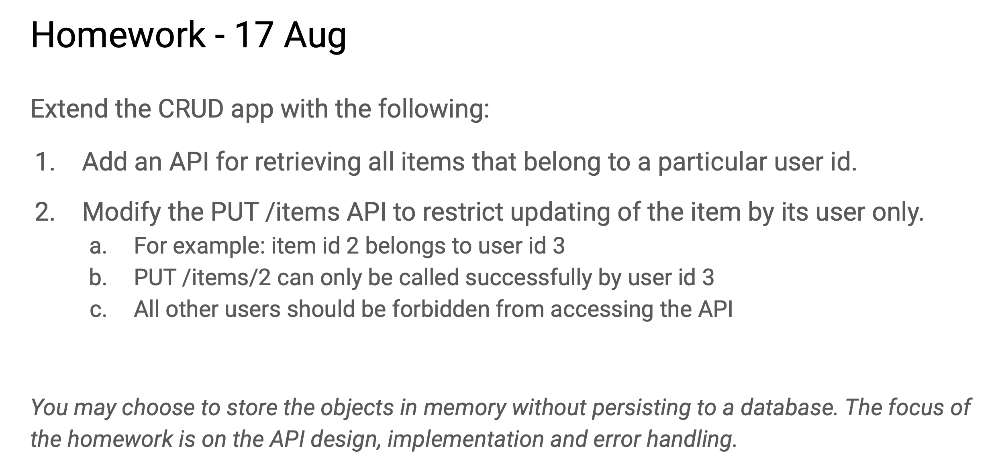

# BackendDev Homework-17Aug2021 (Day 3)


I obtained the uid from the JWT token to control what the user can retrieve and update. So, GET /user/:uid/items and PUT /user/:uid/items/:id will be meaningless.

As such, I did not change the routes
GET /items
PUT /items/:id


# Question 1
[click to see] (./5d-jwt/src/routes/items.js)
```js
// 5d-jwt/src/routes/items.js
  router.get('/', async (req, res, next) => {
    const uid = req.uid
    const items = await db.findAllItems(uid)
    res.send(items)
  })
```
```js
 //5d-jwt/src/db/items.js
  db.findAllItems = async (uid) => {
    const res = await pool.query(
      'SELECT * FROM Items WHERE uid=$1',
      [uid]
    )
    return res.rows.map(row => new Item(row))
  }
```


# Question 2

```js
//5d-jwt/src/routes/items.js
 router.put('/:id', async (req, res, next) => {
    const uid = req.uid
    const id = req.params.id
    const { name, quantity } = req.body
    const updatedItem = new Item({ name, quantity, uid })
    const item = await db.updateItemByUid(id, updatedItem)
    const itemExist = await db.findItem(id)

    item ?  res.status(200).send(item) : 
            itemExist? res.status(401).send(`Item id ${id} does not belong to user`) :
                       res.status(404).send(`Item id ${id} not found`)
  })
```
```js
//5d-jwt/src/db/items.js
  db.updateItemByUid = async (id, item) => {
    const res = await pool.query(
      'UPDATE Items SET name=$2, quantity=$3, uid=$4 WHERE id=$1 AND uid=$5 RETURNING *',
      [id, item.name, item.quantity, item.uid, item.uid]
    )
    // console.log(res)
    return res.rowCount ? new Item(res.rows[0]) : null;
  }

```